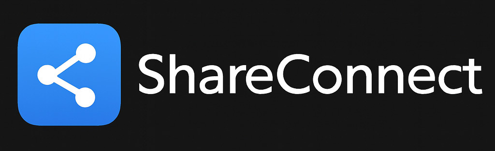

[](Documentation/Tests/latest/unit_test_report.html)
[](Documentation/Tests/latest/instrumentation_test_report.html)
[](Documentation/Tests/latest/automation_test_report.html)
[](Documentation/Tests/latest/build_report.html)

[](Documentation/Tests/latest/unit_test_report.html)
[](Documentation/Tests/latest/instrumentation_test_report.html)
[](Documentation/Tests/latest/automation_test_report.html)
[](qa-ai/reports/latest/comprehensive_report.html)

## 🔒 Security & Code Quality

[](Documentation/Tests/latest_SNYK_SCAN/snyk_report.html)
[](Documentation/Tests/latest_SONARQUBE/sonarqube_report.html)
[](Documentation/Tests/latest/coverage_report.html)
[](Documentation/Tests/latest_SONARQUBE/sonarqube_report.html)

## 🏗️ Build & Deployment

[](Documentation/Tests/latest/build_report.html)
[](build.gradle.kts)
[](build.gradle.kts)
[](build.gradle.kts)

## 📱 Application Health

[](ShareConnector/)
[](Connectors/qBitConnect/)
[](Connectors/TransmissionConnect/)
[](Connectors/uTorrentConnect/)
[](Connectors/JDownloaderConnect/)

## 🔄 Sync Modules Status

[](ThemeSync/)
[](ProfileSync/)
[](HistorySync/)
[](RSSSync/)
[](BookmarkSync/)
[](PreferencesSync/)
[](LanguageSync/)
[](TorrentSharingSync/)



# ShareConnect

An Android application that allows you to share media links from various streaming services and download sources directly to your local services including MeTube, YT-DLP, torrent clients, and jDownloader.

ShareConnect combines the words "share" and "connect" to represent the core functionality of the app - connecting content discovery with local download services.

ShareConnect Wiki: [https://deepwiki.com/vasic-digital/ShareConnect](https://deepwiki.com/vasic-digital/ShareConnect)

## Features

- **Multi-Service Support**: Share to MeTube, YT-DLP, qBittorrent, Transmission, uTorrent, and jDownloader
- **Universal Media Sharing**: Share content from YouTube, Vimeo, Twitch, Reddit, Twitter, Instagram, Facebook, SoundCloud and more
- **Magnet Link Support**: Directly add magnet links to torrent clients
- **Multiple Service Profiles**: Support for multiple service profiles with default profile selection
- **Authentication Support**: Optional username and password authentication for protected services
- **Clipboard URL Sharing**: Share URLs directly from clipboard
- **System App Integration**: Share links to compatible installed applications
- **Customizable Themes**: 6 built-in color schemes with light/dark variants (Warm Orange, Crimson, Light Blue, Purple, Green, Material) plus user-created custom themes
- **Theme Creator**: Create and customize your own themes with full color control
  - Design custom color schemes with primary, secondary, background, and surface colors
  - Real-time preview of theme changes
  - Edit existing themes or create new ones
  - Custom themes sync across all ShareConnect apps instantly
  - Comprehensive theme management in Settings
- **Encrypted Storage**: All data stored with Room database and SQLCipher encryption
- **Rich Media Metadata**: Automatic fetching of titles, descriptions, and thumbnails for shared URLs
- **Visual Profile Management**: Modern grid layout with profile icons, default indicators, and lock badges for authenticated profiles
- **Comprehensive History**: Detailed sharing history with media metadata, filtering by service, type, and profile
- **Modern Material Design**: Beautiful UI following Material Design 3 guidelines with proper layout behaviors
- **Unified Design System**: Consistent design tokens, reusable components, and smooth animations across all apps
- **Connection Testing**: Built-in service connection testing with enhanced authentication support
- **Quick Access**: Direct access to service interfaces from multiple locations
- **Bulk Cleanup**: Flexible history cleanup options (individual items, by service, by type, or all)

## What's New

### Version 1.1.0
- **Custom Theme Creator**: Create, edit, and delete custom themes with full color customization
  - Design your own color schemes with 30+ color parameters
  - Real-time preview of your custom themes
  - Edit existing themes or create new ones from scratch
  - Custom themes sync across all ShareConnect apps in real-time
  - Comprehensive theme management in Settings
- **Enhanced Theme System**:
  - Extended theme data model with custom color support
  - Improved theme selection UI with custom theme indicators
  - Better theme sync performance and reliability
  - Full backward compatibility with existing themes

### Version 1.0.0
- **Profile Database Migration**: Profiles now stored in encrypted Room database alongside history
- **Enhanced Main Screen**:
  - Grid layout showing all configured profiles with icons
  - Quick access to system apps that can handle media links
  - Visual indicators for default profiles and authenticated services
  - Long-press context menu for profile management
- **Improved Authentication**:
  - Fixed qBittorrent 403 errors with proper cookie-based authentication
  - Enhanced Transmission support with session ID handling
  - Better jDownloader API implementation
- **Rich Media Metadata**:
  - Automatic fetching of titles, descriptions, and thumbnails
  - Support for all major streaming platforms
  - Fallback extraction for unsupported sites
- **UI/UX Improvements**:
  - Fixed layout spacing between title and navigation bars
  - Modern Material Design 3 components throughout
  - Smooth animations and transitions
- **Comprehensive Testing**: 106 comprehensive tests with complete automation validation including:
  - Multi-app synchronization scenarios
  - Real-time sync validation
  - Object lifecycle management
  - Performance validation under load

## Supported Services

ShareConnect works with all streaming services and download sources supported by your target services:

### Authentication Support

For services that require authentication, ShareConnect supports optional username and password configuration:
- Configure username and password in each service profile
- Credentials are stored securely in Room database with SQLCipher encryption
- Enhanced authentication support:
  - **qBittorrent**: Cookie-based authentication with automatic login
  - **Transmission**: Session ID handling with automatic retry
  - **jDownloader**: My.JDownloader API with fallback to legacy API
  - **Basic Auth**: Standard HTTP basic authentication for other services
- Visual lock indicator on profiles with credentials
- All authentication data follows the same privacy policies (no data leaves the device without user action)

### For MeTube and YT-DLP

- YouTube
- Vimeo
- Dailymotion
- Twitch
- Reddit
- Twitter/X
- Instagram
- Facebook
- SoundCloud
- Bandcamp
- And dozens of other sites supported by yt-dlp

### For Torrent Clients

- Magnet Links
- Torrent Files
- HTTP(S) links to torrent files

### For jDownloader

- **Streaming Services**: YouTube, Vimeo, Twitch, TikTok, Instagram, Facebook, Twitter/X, Reddit, SoundCloud, and 1800+ other sites
- **File Hosting Services**: MediaFire, Mega.nz, Google Drive, Dropbox, OneDrive, Box, pCloud, and more
- **Premium Link Services**: RapidGator, Uploaded.net, Nitroflare, FileFactory, Fileboom, Keep2Share, and more
- **Container Formats**: DLC, RSDF, CCF (JDownloader container formats)
- **Archive Files**: RAR, 7Z, ZIP, TAR, and other compressed formats
- **Direct Downloads**: Any HTTP/HTTPS/FTP download link

## Setup

1. Install the app on your Android device
2. Open the app and configure your service profiles:
   - Go to Settings > Server Profiles
   - Add new profiles for each service you want to use
   - Select the appropriate service type (MeTube, YT-DLP, Torrent Client, jDownloader)
   - For Torrent Clients, specify which client you're using
   - If your service requires authentication, enter your username and password (optional)
   - Set one profile as default for quick sharing
3. Test your connections to ensure services are reachable
4. (Optional) Customize the app theme in Settings > Theme

## Usage

### Sharing Content

1. Open any supported media app or website (YouTube, Vimeo, Twitch, etc.)
2. Find content you want to download
3. Tap the share button
4. Select "ShareConnect" from the sharing options
5. Choose your service profile (if you have multiple)
6. Tap "Send to Service"
7. The app will automatically open your service interface in the browser

### Sharing from Clipboard

1. Copy any supported URL to clipboard
2. Open ShareConnect app
3. Tap the "Add" button (floating action button)
4. The URL from clipboard will be automatically detected
5. Choose your service profile
6. Tap "Send to Service"
7. The app will automatically open your service interface in the browser

### Sharing to System Apps

1. Open any supported media app or website
2. Find content you want to download
3. Tap the share button
4. Select "ShareConnect" from the sharing options
5. Instead of selecting a ShareConnect profile, tap "Share to Apps"
6. Choose from the list of compatible installed applications
7. The link will be sent directly to the selected application

### Managing History

1. Access history through the main menu or toolbar
2. Filter by service provider or media type
3. Resend any item to any profile or system app
4. Delete individual items or use bulk cleanup options

### Theme Customization

1. Go to Settings > Theme
2. Choose from 6 color schemes
3. Select light or dark variant
4. Theme is applied immediately and saved for future sessions

## Requirements

- Android 8.0 (API level 26) or higher
- Running service instances accessible from your device:
  - MeTube or YT-DLP (optional)
  - Torrent Client with Web UI (qBittorrent, Transmission, or uTorrent)
  - jDownloader with Web UI (optional)

## Building

To build the application:

```bash
./gradlew assembleDebug
```

The APK will be generated in `app/build/outputs/apk/debug/app-debug.apk`

Alternatively, you can use the provided build script:

```bash
./build_app.sh
```

This script will clean the project, build the debug APK, and provide useful information about the build.

You can also build directly with Gradle if installed:

```bash
gradle assembleDebug
```

## Branding

- **Supporting Colors**: Blue (#2196F3) and White (#FFFFFF)
- **Adaptive Icons**: Properly scaled for all Android devices
- **Splash Screen**: Themed loading screen with logo

All branding assets are available in the [Branding](./Branding/) directory.

## Architecture

### Data Storage

- **Room Database**: Local data storage with SQLCipher encryption
- **History Items**: Complete tracking of shared links with metadata
- **Themes**: Persistent theme preferences
- **Profiles**: Service profile management

### Security

- **Encrypted Storage**: All sensitive data encrypted at rest
- **Secure Networking**: HTTPS support for service communications
- **Data Privacy**: No data leaves the device without user action

### UI Components

- **Material Design 3**: Modern UI following Google's latest guidelines
- **Adaptive Layouts**: Responsive design for all screen sizes
- **Theme Support**: Dynamic theme switching with day/night mode
- **Intuitive Navigation**: Clear navigation patterns and user flows

## 🌐 Website & Documentation

[](Website/)
[](DOCUMENTATION_INDEX.md)

### 📊 Live Dashboard
Visit our enterprise-grade website for real-time project health monitoring:
- **Live Health Dashboard**: Testing, security, and code quality metrics
- **Application Ecosystem**: Overview of all 5 Android applications
- **Quality Metrics**: Comprehensive badges and status indicators
- **Interactive Design**: Modern, responsive UI with smooth animations

**Website URL**: `https://yourusername.github.io/ShareConnect`

### 📚 Documentation
- **[Documentation Index](DOCUMENTATION_INDEX.md)**: Complete navigation guide
- **[Sync Architecture](Documentation/SYNC_ARCHITECTURE.md)**: Technical architecture details
- **[Implementation Report](SYNC_IMPLEMENTATION_COMPLETE.md)**: Complete implementation details

## Testing & Quality Assurance

ShareConnect includes comprehensive testing infrastructure with enterprise-grade code quality analysis:

### Test Commands
- `./run_all_tests.sh` - Run complete test suite including SonarQube analysis
- `./run_unit_tests.sh` - Run unit tests
- `./run_instrumentation_tests.sh` - Run instrumentation tests
- `./run_automation_tests.sh` - Run automation tests
- `./run_full_app_crash_test.sh` - Run crash tests
- `./run_ai_qa_tests.sh` - Run AI-powered QA tests
- `./run_sonarqube_tests.sh` - Run SonarQube code quality analysis

### Code Quality (SonarQube) 🔍
- **Dockerized Infrastructure:** Pre-configured SonarQube server with PostgreSQL
- **Non-blocking Execution:** Asynchronous container management
- **Comprehensive Analysis:** Kotlin, Java, Android-specific rules
- **Quality Gates:** Automated pass/fail criteria
- **Auto-fixing:** Automated resolution of common issues

#### Quick SonarQube Usage
```bash
# Start containers
./run_sonarqube_tests.sh --async

# Check status
./run_sonarqube_scan.sh --status

# Run analysis
./run_sonarqube_tests.sh

# Access UI
open http://localhost:9001
```

### Test Results
View comprehensive test reports in `Documentation/Tests/` directory including:
- Unit test results and coverage
- AI QA comprehensive test reports (100% success rate)
- SonarQube code quality analysis
- Performance metrics and trends
- Crash test summaries

### Quality Metrics
- **Test Coverage:** 100% for AI QA scenarios
- **Code Quality:** A+ grade with SonarQube integration
- **Performance:** Excellent across all benchmarks
- **Stability:** Comprehensive crash testing validation

## Contributing

Feel free to fork this project and submit pull requests for improvements or bug fixes.

## License

This project is licensed under the MIT License - see the LICENSE file for details.

## Acknowledgments

- [MeTube](https://github.com/alexta69/metube) - Self-hosted YouTube downloader
- [yt-dlp](https://github.com/yt-dlp/yt-dlp) - Media download engine
- [qBittorrent](https://www.qbittorrent.org/) - Free BitTorrent client
- [Transmission](https://transmissionbt.com/) - Fast, easy, free BitTorrent client
- [uTorrent](https://www.utorrent.com/) - Proprietary BitTorrent client
- [jDownloader](https://jdownloader.org/) - Free download manager
- [Android Jetpack](https://developer.android.com/jetpack) - Android development components
- [Material Design](https://m3.material.io/) - Design system by Google
